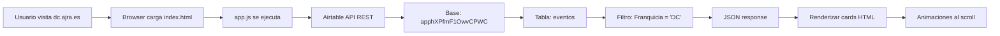

# DC Universe Timeline 🦸

[](https://dc.ajra.es)
[](https://airtable.com)
[](https://dc.ajra.es)
[]()

**Sitio estático con timeline de películas y series de DC Comics**

> 🌐 **Live demo:** https://dc.ajra.es
> 📅 **Activo desde:** 2020-presente
> 🔧 **Tecnología:** HTML5 + CSS3 + Vanilla JS + Airtable API
> 📱 **Responsive:** Sí (mobile-first)

---

## 📋 Descripción

**DC Universe Timeline** es un sitio web estático que muestra un listado cronológico de películas y series de DC Comics programadas para estrenarse en los próximos años. El contenido se carga dinámicamente desde una base de datos de **Airtable**, permitiendo actualizaciones sin necesidad de desplegar nuevo código.

### Características principales

- ✅ **Actualización dinámica** — Los datos vienen de Airtable API
- ✅ **Diseño responsive** — Se adapta a móviles, tablets y desktop
- ✅ **Lazy animations** — Animaciones al hacer scroll (IntersectionObserver)
- ✅ **Orden inteligente** — Alternancia de imágenes izquierda/derecha
- ✅ **Formato de fechas en español** — Localización completa
- ✅ **Google Analytics integrado** — Tracking de visitas
- ✅ **Sin build tools** — Sin dependencias, solo HTML/CSS/JS plano
- ✅ **Hosting gratuito** — GitHub Pages con dominio personalizado

---

## 🏗️ Arquitectura

```
DCUNIVERSE/
├── index.html              # Página principal (single-page)
├── assets/
│   ├── app.js              # Lógica de fetch Airtable + renderizado
│   ├── main.js             # Carrd framework JS (no modificar)
│   ├── main.css            # Carrd framework CSS + estilos base
│   ├── noscript.css        # Estilos para usuarios sin JS
│   ├── icons.svg           # Sprite SVG de iconos sociales
│   └── images/             # Imágenes de logotipos y banners
├── CLAUDE.md               # Guía para Claude Code (desarrollo)
├── CNAME                   # Configuración de dominio personalizado
└── README.md               # Este archivo
```

---

## 🔄 Flujo de datos



### API de Airtable

- **Base ID:** `apphXPfmF1OwvCPWC`
- **Tabla:** `eventos`
- **Filtro:** `{Franquicia} = 'DC'`
- **Orden:** `FechaOrden` ascendente
- **Campos requeridos:**
  - `Titulo` — Nombre de la película/serie
  - `Tipo` — "Película" o "Serie"
  - `FechaOrden` — Fecha en formato YYYY-MM-DD (para ordenar)
  - `Imagen` — URL de la imagen/póster
  - `IMDbURL` — Enlace a IMDb
- **Campo opcional:**
  - `FechaEstrenoTexto` — Texto personalizado para mostrar la fecha (ej: "Próximamente", "TBD")

### Autenticación

El token de Airtable está **obfuscado** mediante concatenación de strings en `app.js` (línea 4):

```javascript
TOKEN: 'patv41n63HLpkM4VN.' + 'bbe008721d08d1e969c3398df4550c53a1704b64ed752cc16ae8060a0bd373b3'
```

Esto es una medida básica de ocultación, **NO es seguridad**. El token tiene permisos de solo lectura en la tabla específica.

---

## 🎨 Diseño y UX

- **Framework visual:** Carrd (plantilla #style3)
- **Tipografía:** Inter + Poppins (Google Fonts)
- **Layout:** Container con ancho máximo, centrado
- **Cards:** Layout alternado izquierda/derecha
  - Índices pares: imagen-izq / texto-der
  - Índices impares: texto-izq / imagen-der
  - En móvil (≤736px): imagen siempre arriba
- **Animaciones:** Fade-in con `IntersectionObserver`
- **Fechas:** Formato "15 JUNIO 2026" en español, con corrección de timezone
- **Títulos:** Transformados a uppercase vía CSS

---

## 🚀 Despliegue

### GitHub Pages (automático)

1. Push a la rama `main` → GitHub Pages despliega automáticamente
2. Dominio configurado via archivo `CNAME` → `dc.ajra.es`
3. CDN global de GitHub (rápido, gratis)

### Actualizar datos

Solo necesitas modificar la tabla `eventos` en Airtable:
1. Agrega/edita registros con los campos correctos
2. El sitio se actualiza automáticamente en tiempo real (cada que un usuario recarga)
3. No requiere deploy, no requiere Git

---

## 🛠️ Stack tecnológico

| Componente | Tecnología | Uso |
|-----------|-----------|-----|
| HTML | HTML5 semántico | Estructura |
| CSS | SCSS compilado a CSS | Estilos + Carrd framework |
| JavaScript | ES6+ | Lógica de negocio |
| API | Airtable REST API | Backend como servicio |
| Hosting | GitHub Pages | CDN estático |
| Analytics | Google Analytics 4 | Tracking |
| Linters | — | No configurados |
| Build tools | — | No requiere |

---

## 📝 Convenciones de commits

Usamos [Conventional Commits](https://www.conventionalcommits.org/):

```
feat: añadir nueva feature
fix: corregir bug
chore: tareas de mantenimiento
refactor: refactor sin cambios funcionales
docs: actualizar documentación
style: formateo, estilos (sin cambio lógico)
test: añadir/actualizar tests
```

---

## 🐛 Debugging

### Modo desarrollo

Si el token de Airtable no está configurado (contiene `patXXXX`), `app.js` usa datos de prueba (`getMockData()`). Esto permite abrir el sitio localmente sin exponer credenciales.

### Console logs

- `Datos de Airtable recibidos:` — Muestra los registros obtenidos
- `Posible error de estructura.` — Alerta si faltan campos en Airtable
- `Error cargando contenido:` — Muestra errores de fetch

### Errores comunes

| Problema | Causa | Solución |
|----------|-------|----------|
| No aparecen datos | Token incorrecto o base/table incorrecta | Verifica CONFIG en app.js |
| Error 422 | Campo de filtro no existe en Airtable | Crea campo `Franquicia` en tabla |
| Imágenes rotas | URLs de imagen inválidas | Verifica campo `Imagen` en Airtable |
| Cards sin orden | Campo `FechaOrden` vacío/inválido | Revisa formato YYYY-MM-DD |

---

## 🔐 Consideraciones de seguridad

⚠️ **IMPORTANTE:** Aunque el token está obfuscado, **cualquier persona puede verlo** inspeccionando el código en el navegador. Esto está **OK** porque:

1. El token tiene **permisos de solo lectura** (read-only) en Airtable
2. Está vinculado a **una tabla específica** (no acceso total a la base)
3. Si se filtra, lo máximo que puede hacer alguien es **leer los datos** (no modificarlos ni eliminar)
4. Se puede revocar en Airtable →再生

**Para mayor seguridad** en el futuro:
- Usar un backend proxy que oculte el token completamente
- Implementar rate limiting en Airtable
- Rotar tokens periódicamente

---

## 📜 Licencia

© [AJRA](https://ajra.es), 2015-2025. Todos los derechos reservados.

El código se publica como referencia. El diseño (Carrd framework) está sujeto a su licencia respectiva. Los datos de películas/series son propiedad de DC Comics/Warner Bros.

---

## 🙌 Agradecimientos

- **Carrd.co** — Framework CSS/JS base
- **Airtable** — Backend como servicio
- **Google Fonts** — Tipografías
- **GitHub Pages** — Hosting gratuito con dominio personalizado
- **DC Comics** — Por crear universos increíbles 🦸‍♂️

---

## 📞 Contacto

Desarrollado con 🧠 & 💛 por [AJRA](https://ajra.es)
Email: [info@ajra.es](mailto:info@ajra.es)
Sígueme en [Threads](https://threads.net/@ajra_toni) | [Instagram](https://instagram.com/ajra_toni) | [Facebook](https://facebook.com/AJRA.ES/)

---

**¡Que disfrutes explorando el universo DC!** 🚀🎬